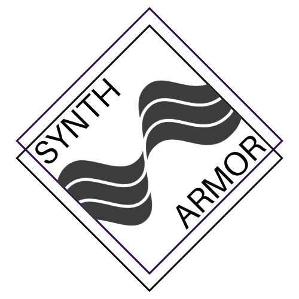

# SynthArmor

  

SynthArmor is a powerful yet user-friendly web application built with Vue.js that empowers you to create custom 3D models for your synth cover. With an intuitive interface, live preview, and flexible design controls, you can easily adjust dimensions and fine-tune details to generate a tailor-made STL file for 3D printing. Whether you're a musician or a DIY enthusiast, SynthArmor offers a simple and efficient solution for creating unique gear protection.

Live app: [https://davidferlay.github.io/SynthArmor/](https://davidferlay.github.io/SynthArmor/)
